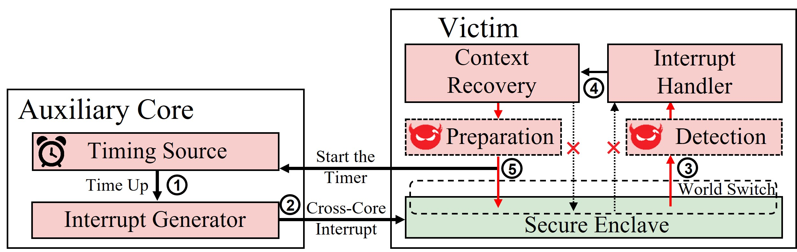
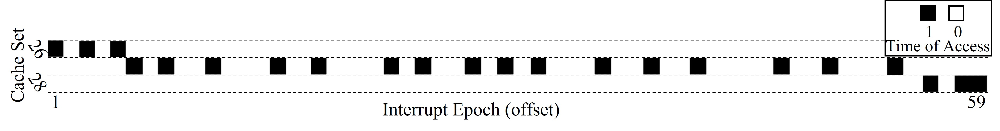
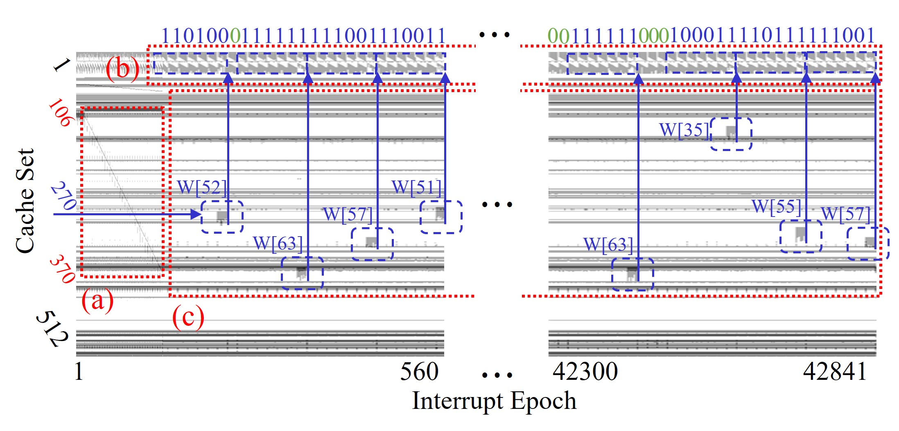

## Load-Step: A Precise TrustZone Execution Control Framework

This repository contains the source code of Load-Step -- a prototype design of the TrustZone execution control framework for exploring side-channel attacks. For more details, please see our paper on DAC 2021.



> Z. Kou, W. He, S. Sinha and W. Zhang, "Load-Step: A Precise TrustZone Execution Control Framework for Exploring New Side-channel Attacks Like Flush+Evict," 2021 58th ACM/IEEE Design Automation Conference (DAC), 2021, pp. 979-984, doi: 10.1109/DAC18074.2021.9586226.
>
> [PDF](https://ieeexplore.ieee.org/abstract/document/9586226)

> Acknowledged by MbedTLS as [high severity](https://mbed-tls.readthedocs.io/en/latest/tech-updates/security-advisories/mbedtls-security-advisory-2020-09-2/).
> Issued by [CVE-2021-36647](https://www.cve.org/CVERecord?id=CVE-2021-36647).

### Abstract

Trusted Execution Environments (TEEs) are imported into processors to protect the sensitive programs against the potentially malicious operating system (OS), though, they are announced not effective to defend microarchitecture (uarch) side-channel attacks. We propose the Load-Step, a precise framework that periodically interrupts the victim program in the TrustZone system and then conducts uarch side-channel attacks. Our self-designed benchmark shows that the Load-Step can invoke interrupts with load-instruction precision. When attacking the RSA decryption in the latest MbedTLS library, the Load-Step can recover the full key by only a single trace in 7.5 seconds. Our work thus breaches the exponent blinding, which aims to defend RSA decryption against side-channel attacks in the MbedTLS library.     


### Threat Model
Our attack assumes that a cryptography library is implemented in the secure world and offers normal world services to invoke. Meanwhile, the OS in the normal world is assumed malicious which means the attacker can install any external kernel module or software driver to the OS. The attacker can assign any specific core to run a cryptography program in the secure world. These assumptions are common for launching attacks on TEEs and still within the assumptions made by the TrustZone.

Our framework is built as an external kernel module, running on the [Hikey960](https://www.96boards.org/product/hikey960/) board with the reference implementation of the [Trusted Firmware](https://www.trustedfirmware.org/).
### Building and Running

1. Compile the kernel module, whether cross-compile or not:
    ```bash
    $ make 
    $ insmod Load_Step.ko
    ```

1. Conduct the attack:
    ```bash
    $ echo 0 > /sys/kernel/debug/Load_Step/set_side_channel
    $ echo 200000 > /sys/kernel/debug/Load_Step/set_enable
    $ ./victim_program
    $ echo 0 > /sys/kernel/debug/Load_Step/set_disable
    ```
    or use our offered script:
    ```bash
    $ taskset 20 ./attack_script.sh A53 L2_PP 200000
    ```

1. Analyze the results
    get monitored data from the debugfs dir
    ```bash
    $ make -C tools/get_fsdata
    $ get_data 256
    ```
    plot the resultant data.csv
    ```bash
    $ python3 plot.py
    ```
### Resutls

##### Interrupt the benchmark program by every load-instruction:

##### Sigle trace profiling of the RSA in MbedTLS 2.22.0:

